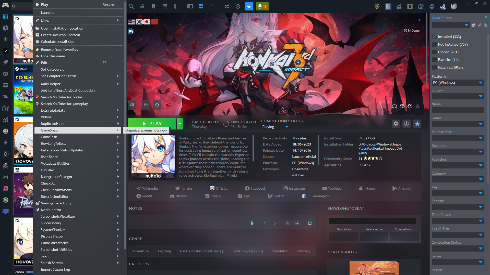
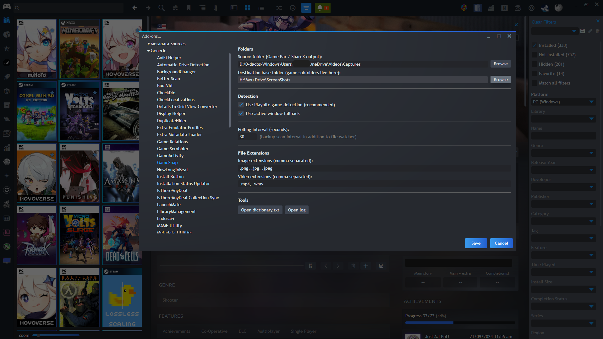
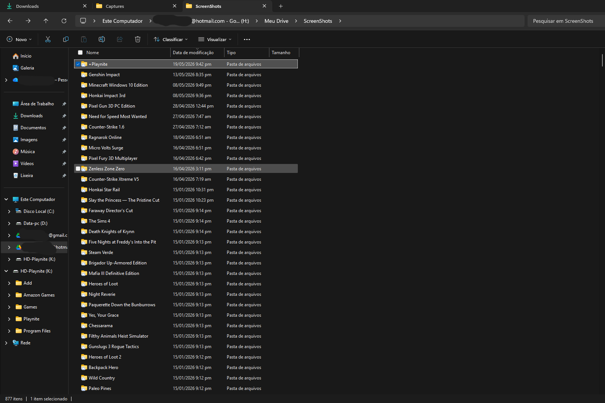
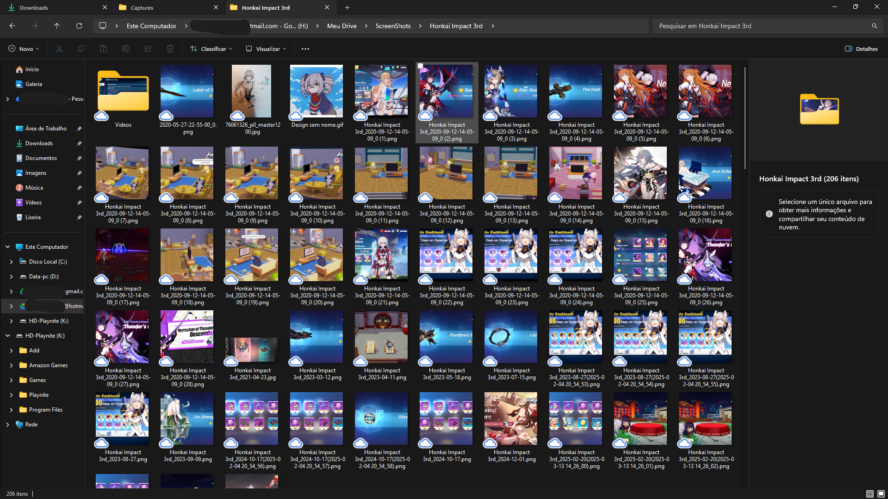

# GameSnap

A [Playnite](https://playnite.link/) plugin that **automatically organizes your game screenshots** into per-game folders — works with Xbox Game Bar, ShareX, and any other capture tool.

---

## Screenshots






---

## How it works

GameSnap watches a single "drop folder" where all your screenshots land, regardless of which tool captured them. When a new file appears, it:

1. Checks the **dictionary** for a known alias → moves to the matching game folder
2. Falls back to **Playnite's currently running game** → moves and learns the alias for next time
3. Falls back to the **active window title** → moves and logs the detection
4. If nothing matches → moves to `_Unmatched` folder for manual review

Everything runs natively inside Playnite — no background `.ps1` scripts, no `.vbs` launchers, no manual setup in the Scripts tab.

---

## Requirements

- Windows 10 or 11
- [Playnite](https://playnite.link/) 9 or later
- .NET Framework 4.8 (included in Windows 10/11)
- A capture tool that saves to a configurable folder (Xbox Game Bar, ShareX, etc.)

---

## Installation

### Option A — Direct download (recommended)

1. Download the latest `.pext` file from the [Releases](https://github.com/TokamiGankei/GameSnap/releases) page
2. Double-click the `.pext` file — Playnite will install it automatically
3. Restart Playnite

### Option B — Manual

1. Download and extract the release `.zip`
2. Copy the folder to:  
   `%AppData%\Playnite\Extensions\GameSnap`
3. Restart Playnite

---

## Setup

### Step 1 — Configure your capture tool

Point your capture tool's output to a single folder, for example `C:\Captures\`.

**Xbox Game Bar:** Settings → Gaming → Captures → Change where clips are saved

**ShareX:** Task Settings → File naming → Override Screenshots Folder per hotkey

### Step 2 — Configure GameSnap

In Playnite, go to **Add-ons → GameSnap → Settings** and fill in:

| Setting | Description |
|---|---|
| Source folder | The drop folder where all screenshots land |
| Destination base | The parent folder that contains your per-game subfolders |
| Use Playnite detection | Recommended — identifies the game while it's running |
| Use active window fallback | Secondary detection when no game is active in Playnite |
| Auto-create game folders | Automatically creates a subfolder when a new game is played |

### Step 3 — Create your game folders

Inside the destination base, create one subfolder per game:

```
ScreenShots\
├── Cyberpunk 2077\
├── Elden Ring\
├── Celeste\
└── ...
```

> **Tip:** Enable **Auto-create game folders** in Settings to have GameSnap create these automatically whenever you start a game for the first time.

---

## Works great with ScreenshotsVisualizer

GameSnap pairs naturally with [ScreenshotsVisualizer](https://github.com/Lacro59/playnite-screenshotsvisualizer-plugin). They serve different purposes:

- **GameSnap** organizes screenshots into per-game folders automatically
- **ScreenshotsVisualizer** displays and browses those screenshots inside Playnite

When both are installed, GameSnap automatically notifies ScreenshotsVisualizer to refresh whenever a screenshot is moved — so your screenshots appear instantly in the viewer without any manual refresh.

### Suggested ScreenshotsVisualizer configuration

In ScreenshotsVisualizer settings, set the **Global screenshots path** to:

```
H:\Your\ScreenShots\Destination\{Name}
```

Replace `H:\Your\ScreenShots\Destination\` with your GameSnap **Destination base** folder. The `{Name}` token is resolved automatically by ScreenshotsVisualizer to the game name, matching the subfolders GameSnap creates.

This single setting covers your entire library without configuring each game individually.

---

## Emulator support

GameSnap can monitor screenshot folders from emulators and organize them alongside your PC game screenshots. Enable it in **Settings → Emulators**.

Supported out of the box: RetroArch, PCSX2, Dolphin, RPCS3, Cemu, PPSSPP, mGBA, DuckStation.

Custom emulators can be added with the **+ Add emulator** button.

---

## Dictionary

The dictionary lets you map any filename prefix or alias to a game folder. Open it from **Add-ons → GameSnap → Open dictionary**.

Format:

```
[Cyberpunk 2077]
cyberpunk
cp2077

[Elden Ring]
eldenring
ELDEN RING
```

GameSnap **learns automatically** — when Playnite detection identifies a game, the alias is saved so future screenshots are matched instantly.

---

## Menu reference

| Menu item | Where | What it does |
|---|---|---|
| Organize screenshots now | Main menu → GameSnap | Manually triggers a full scan of the source folder |
| Open log | Main menu → GameSnap | Opens the log file in Notepad |
| Open dictionary | Main menu → GameSnap | Opens dictionary.txt in Notepad |
| Review unmatched screenshots | Main menu → GameSnap | Opens the review window for unmatched files |
| Organize screenshots now | Right-click a game | Same as above, scoped to context |

---

## Troubleshooting

**Screenshots are not being moved**  
→ Check that source and destination folders are correctly set.  
→ Open the log (**Main menu → GameSnap → Open log**) to see what happened.

**Wrong game folder was chosen**  
→ Move the file manually and add the correct alias to the dictionary.

**A game has no folder yet**  
→ Create the subfolder inside the destination base, or enable **Auto-create game folders**.

**ShareX is saving files with timestamps only**  
→ In ShareX, set the name pattern to `%t %y-%mo-%d_%h-%mi-%s` so the window title is included.

---

## License

MIT — see [LICENSE.txt](LICENSE.txt)

---

## Support

If GameSnap saved you some time, a coffee is always appreciated! ☕

[](https://buymeacoffee.com/TokamiGankei)
